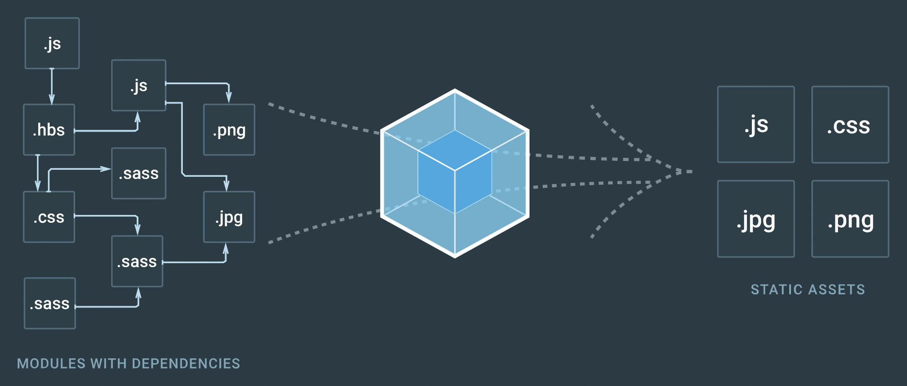

# Technical Selection

## Vue

### Why Choose Vue?

There is already a detailed [Comparison with other frameworks] (https://vuejs.org/v2/guide/comparison.html) article in the Vue documentation. If you have not read it, you can read it first.

But we still want to answer this question from our own perspective.

### Friendly Dependency Management

In React, you need to manually setState or combine complex state management mechanisms from the beginning. When the component tree is complex, you need to manually implement `shouldComponentUpdate` to do some performance optimization. The same is true in Angular. As the size of components increases, you need to always pay attention to potential performance problems caused by component dirty checks.

In Vue, all this is solved by dependency management for developers. When we choose a framework, a very important reference point is whether the framework can fill in more holes, hide many framework-level details, reduce developers' attention as much as possible, and let us focus more on business logic. level.

<!-- ### Data binding -->

### Separation of Templates, Logic and Styles

JSX + CSS-in-JS violates the separation principle of templates, logic, and styles, and mixes these three together, turning them all into a JavaScript development model. Although this method can greatly improve the flexibility of component development, it loses the intuitive feeling of declarative templates and many features of CSS style sheets, which is not worth the gain. At the same time, the possibility of combining templates and styles separately for visual editing is lost.

### Learning Curve

Vue's documentation is very complete, the API design is simple and flexible, and it solves many common front-end problems. The learning curve is undoubtedly the gentlest.

## Webpack

### What is Webpack?

> Webpack = Module Building System

Simply put, Webpack is a packager that packages source files with various dependencies into a series of static resources.

Before the emergence of ES6, JavaScript had no module system like Java or Python's import, which caused a huge obstacle to the development of large and complex front-end projects. At the same time, the front end also needs to process non-JS static resources such as CSS, png, svg, webfonts, etc. There are often many dependencies between these files. Webpack solves these problems very well.

At the same time, Webpack also handles packaging speed, hot updates, and proxy services very well, and Webpack's loaders and plugins are also very sound.

Therefore, Webpack has basically become the standard build tool for front-end projects.

The following [Modularity] section will describe in detail the powerful advantages of Webpack in processing various static resources on the front end, as well as the specific configuration strategies of Kubevue when using Webpack.
